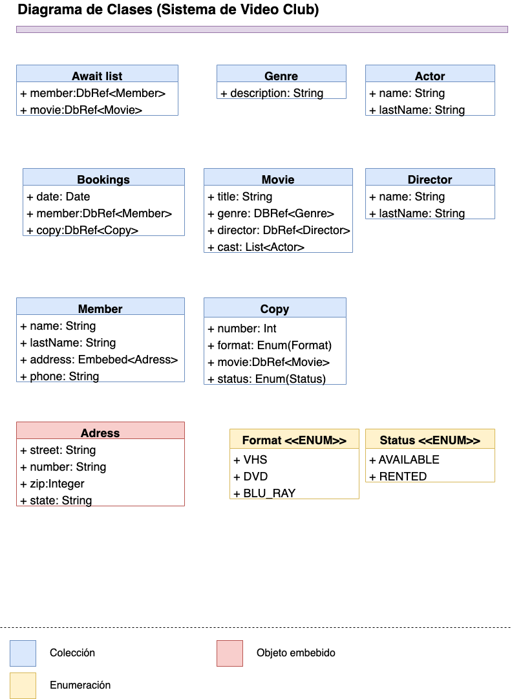

# Práctica | Mi Primera API con Express + ODM 

Web Platforms

## Unidad II

Programación Web del Lado del Servidor 

### Instrucciones

Vamos a construir todos los servicios web relacionados con el ejemplo del video club, basado en el esquema cree para cada modelo todo su CRUD. Una vez terminado suba su proyecto a gitlab en una rama diferente a master. Suba la liga del proyecto una vez terminado.

## Prerequisitos

- [node](https://nodejs.org/es)

- [npm](https://www.npmjs.com/)

- [express](https://expressjs.com/)

## Descripción 

Realizamos el backend de una API utilizando como framework web `express` y un `ODM`.
Haciendo las clases de un `Video Club`.

`Imagen del Diagrama de Clases`:


## Instalación

1. Clonar el repositorio:

```
$ git clone git@github.com:JuanDiazuwu/video_club.git
```

2. Entrar a la terminal, en la raíz el proyecto:

```
$ npm install 
```

## Ejecución

Nota para esto se necesita otro contenedor con la base de datos.

1. En la terminal ejecutar:

```
$ npm run dev
```

Abrir un navegador y escribir en la barra de navegación `http://localhost:3000`

### Ejecución mediante Docker

1. Luego de clonar el repo, y estar en la raíz del proyecto:

```
$ docker-compose build
```

2. Al terminar escribir los siguiente en terminal:

```
$ docker-compose up
```

Abrir un navegador y escribir en la barra de navegación `http://localhost:3000`

Para detenerlo es:

```
$ docker-compose down
```

## Autor

- **Juan Díaz** - [JUAN ANTONIO DIAZ FERNANDEZ](https://gitlab.com/a348637)

## Profesor

Luis Antonio Ramírez Martínez
